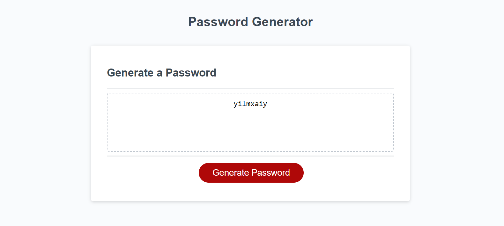
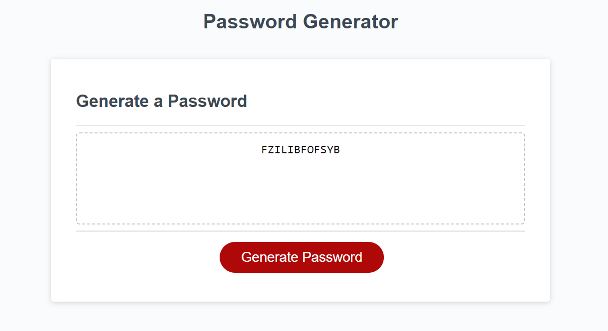
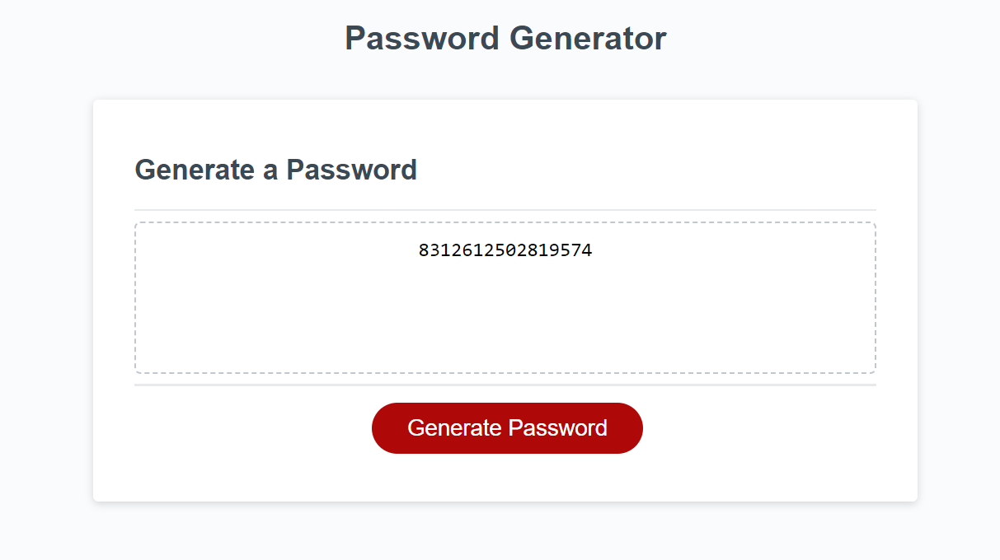
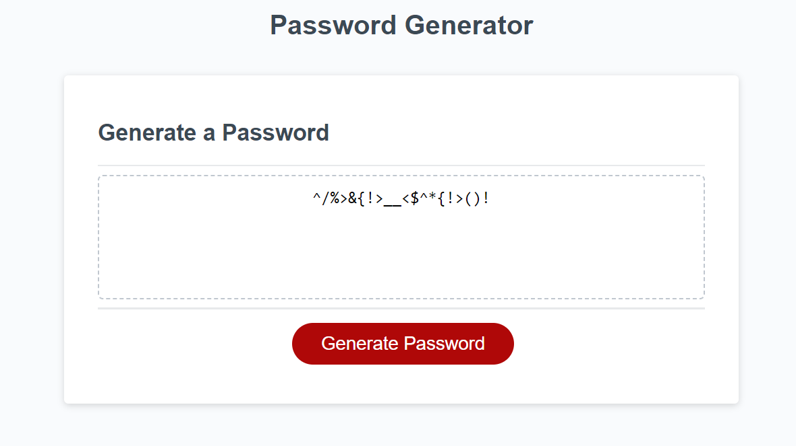
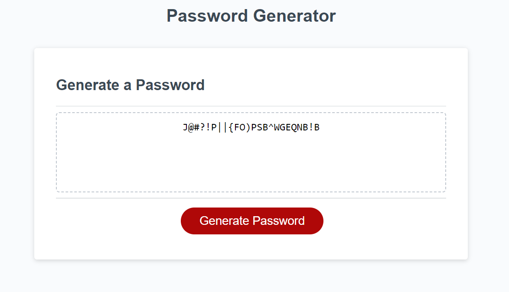
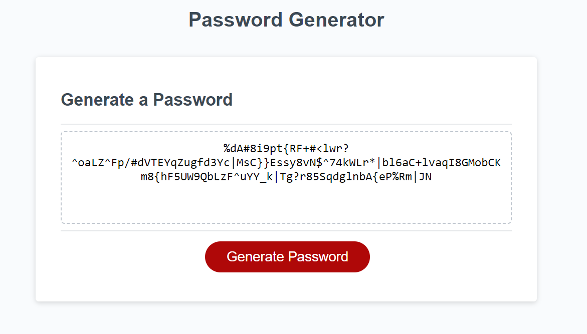

# Password Generator 

## Description
A tool with the ability generate a randomized, potentially complex password. With prompts the user can decide to include or exclude character types such as Lowercase, Uppercase, numbers, and even special characters. The User can also decide the length of the password, within 8 to 128 characters!

## languages used
* CSS
* HTML
* JavaScript

## Screenshots 

 

## Website
https://jettshub.github.io/ideal-goggles/

## Contributors
* Jett Huffhines 
  *  Github: Jettshub